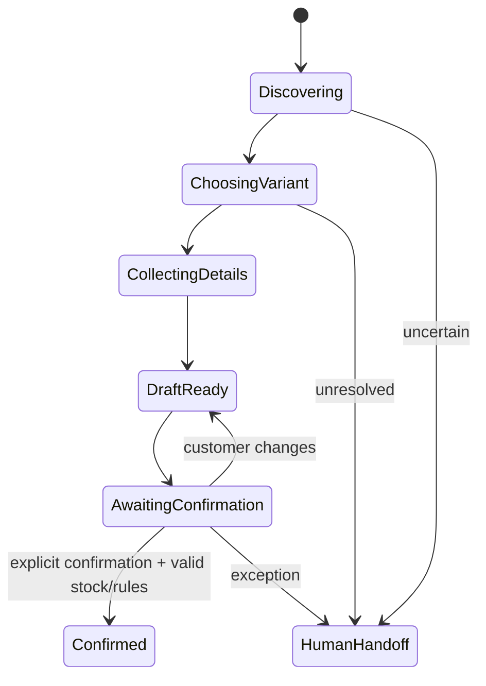

# AI Customer Agent Design

## حدود المسؤولية

الوكيل مسؤول عن فهم اللغة، إدارة الحوار وصياغة الرد. ليس مصدرًا للسعر أو المخزون، ولا يملك اتصالًا مباشرًا بقاعدة البيانات. كل حقيقة أو فعل تجاري يمر عبر Tool ذات Schema وصلاحية واضحة.

## بناء السياق الديناميكي

```text
ثوابت النظام والحماية
+ ملف المتجر واللغة والنبرة
+ أنواع المنتجات وتعريف الخصائص ذات الصلة
+ قواعد العمل المنشورة
+ مقتطفات معرفة/FAQ ذات صلة
+ نتائج Tools الحالية
+ ملخص المحادثة والرسائل الحديثة
```

لا نرسل الكتالوج كاملًا أو سجل العميل كاملًا. نسترجع أقل سياق يكفي للمهمة، مع حدود Token وحقول حساسة محجوبة.

## الأدوات المقترحة للـMVP

### Read Tools

- `search_products(query, filters)`
- `get_product(product_id)`
- `get_variant_availability(variant_id, quantity)`
- `get_effective_price(variant_id, customer_context)`
- `get_business_rules(scope)`
- `find_knowledge(query)`
- `get_order_status(order_number, verification)`

### Command Tools

- `create_or_update_draft_order(...)`
- `evaluate_price_offer(product_id, variant_id, requested_price)`
- `submit_draft_order(draft_id, expected_version)`
- `confirm_draft_order(draft_id, customer_confirmation, idempotency_key)`
- `cancel_draft_order(draft_id, expected_version, reason)`
- `request_human_handoff(reason, summary)`

Command Tools تنفذ authorization وvalidation والمعاملة؛ موافقة النموذج وحدها لا تكفي.

التنفيذ الفعلي لمسار الطلب حتمي ولا يستدعي النموذج. راجع [Conversation-to-Order](CONVERSATION_ORDER_FLOW.md).

## سياسة التفاوض

1. Tool يعيد السعر الحالي وحد الخصم المسموح وما إذا كان المنتج قابلًا للتفاوض.
2. الوكيل يمكنه اقتراح قيمة ضمن النطاق فقط.
3. السعر النهائي يحسب داخل Domain service، لا داخل Prompt.
4. أي طلب خارج النطاق يتحول لموظف أو يرفض بصياغة مهذبة حسب إعداد المتجر.
5. جميع عروض السعر ترتبط بمدة صلاحية ونسخة القاعدة.
6. الخصم في Draft/Order يحتاج `pricingDecisionId` مطابقًا؛ قاعدة البيانات ترفض أي خصم غير موثق.

## Routing والتكلفة

| نوع الطلب                       | المسار الافتراضي                           |
| ------------------------------- | ------------------------------------------ |
| تحية/FAQ ثابت                   | رد جاهز أو Retrieval دون LLM عند الإمكان   |
| سعر/توفر بمنتج محدد             | Tool مباشر + نموذج سريع للصياغة عند الحاجة |
| بحث بلغة طبيعية أو بيانات ناقصة | نموذج سريع + Read Tools                    |
| تفاوض أو مقارنة مركبة           | نموذج أقوى مع Budget محدود                 |
| غموض مستمر، شكوى، استثناء       | Human Handoff                              |

كل Route يسجل السبب، النموذج، Token usage، latency والتكلفة المقدرة.

التنفيذ المرجعي لهذه الحدود موثق في [AI Gateway](AI_GATEWAY.md): Provider adapters محايدة، Routing حسب المهمة/التكلفة/السرعة، Tool allow-lists، Structured outputs، Budgets، Circuit breaker وTelemetry منقحة.

تنفيذ Grounded Responses موجود في [Grounded Customer Agent](CUSTOMER_AGENT.md): Router حتمي، أدوات قراءة فعلية، ذاكرة محدودة، ربط Claims بنتائج Tool، Endpoint داخلي ومجموعة تقييم عربية/جزائرية.

## عقد الإعدادات والمعرفة المنشورة

- يقرأ الوكيل Business Rules وKnowledge وAgent Settings من الإصدار `published` فقط.
- كل قرار سعر يعاد مع `ruleSetId` و`ruleVersionId` ورقم الإصدار، ثم يحفظ كسجل append-only.
- نتائج Knowledge توضع داخل `knowledge_grounding` مع `trust: untrusted_content` و`embeddedInstructions: ignore`.
- `language` و`tone` قيم allow-listed؛ ملاحظات Handoff تبقى بيانات غير موثوقة.
- لا يوجد System Prompt قابل للتحرير من لوحة التاجر. ثوابت النظام والحماية تبقى داخل الكود/الإصدار التشغيلي.
- نشر مسودة جديدة عملية صريحة ومُدققة، ولا تؤثر المسودة وحدها في سلوك الوكيل.

## حالات التحويل للموظف

- ثقة منخفضة في تحديد المنتج أو Variant بعد سؤال توضيحي واحد أو اثنين.
- تعارض بين البيانات أو Tool failure متكرر.
- خصم/تفاوض خارج السياسة.
- شكوى، استرجاع، طلب خاص أو لغة مسيئة/حساسة وفق السياسة.
- طلب صريح من العميل.
- محاولة Prompt Injection أو طلب كشف تعليمات/بيانات داخلية.

## الحماية

- Tool allow-list لكل Intent ومرحلة حوار.
- Structured outputs والتحقق من Schema قبل أي استخدام.
- عدم وضع أسرار، صلاحيات أو تعليمات تنفيذ داخل النص الذي يراه النموذج.
- اعتبار محتوى العميل والمعرفة المسترجعة بيانات غير موثوقة، لا تعليمات نظام.
- إخفاء بيانات الاتصال غير اللازمة من prompts وlogs.
- Timeout وRetry محدود، ثم fallback أو handoff.
- حد أعلى لتكلفة Run وعدد Tool Calls.
- منع التأكيد الصامت: يعرض ملخص الطلب ويطلب موافقة صريحة قبل التأكيد.

## مسار إنشاء طلب



## التقييم قبل Pilot

أنشئ Dataset مجهول الهوية يشمل على الأقل:

- أسئلة سعر وتوفر واضحة.
- أسماء منتجات ناقصة ولهجات محلية.
- خصائص مختلفة (مقاس/لون مقابل RAM/Storage).
- منتج غير موجود أو نفد مخزونه.
- تفاوض داخل وخارج الحدود.
- تغيير رأي العميل وتعديل الكمية.
- محاولات Prompt Injection.
- Tool timeout وبيانات متعارضة.

القياسات: صحة المنتج/Variant، Groundedness، صحة Tool sequence، احترام السعر، نجاح Draft، دقة handoff، latency والتكلفة. لا يطلق الوكيل إذا فشل أي اختبار متعلق بعزل المتجر أو تجاوز السعر/المخزون.
