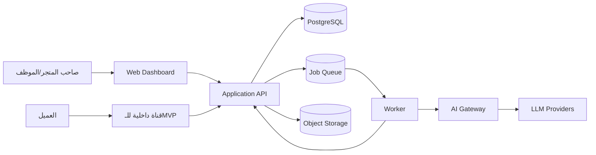
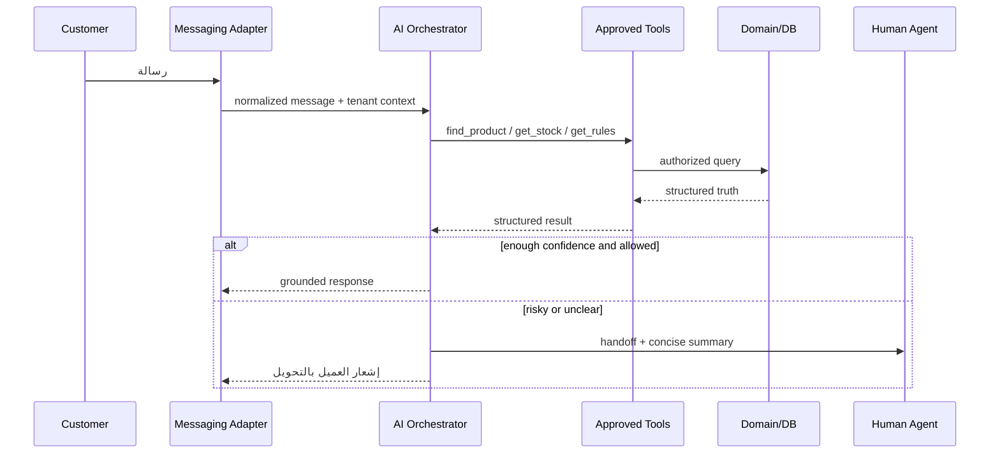

# Architecture — MVP

## القرار المعماري

ابدأ بـ **Modular Monolith** داخل Monorepo، مع Worker منفصل للمهام غير المتزامنة. هذا يقلل تكلفة التشغيل والتعقيد، مع إبقاء حدود واضحة تسمح بفصل Module عند ظهور حاجة حقيقية.

## Context

القنوات الخارجية تُضاف لاحقًا كـAdapters ولا تتصل مباشرة بمنطق الطلب أو المخزون.

## حدود Modules

| Module             | المسؤولية                                                    | لا يملكه             |
| ------------------ | ------------------------------------------------------------ | -------------------- |
| Identity & Tenancy | المستخدمون، العضويات، المتجر والسياق                         | كتالوج أو طلبات      |
| Catalog            | Product Types، Attributes، Products، Variants، Content Links | الرصيد الفعلي        |
| Inventory          | الحركات، الحجز، التحرير والرصد                               | أسعار التفاوض        |
| Orders             | Drafts، Orders، البنود والحالات                              | تنفيذ AI             |
| Customers          | الملفات، العناوين والملاحظات                                 | قناة الرسائل         |
| Conversations      | Threads، Messages، assignment وhandoff                       | قواعد السعر          |
| Rules & Knowledge  | سياسات المتجر وFAQ/Knowledge                                 | تعديل الطلب مباشرة   |
| AI Orchestration   | السياق، Routing، Tools وGuardrails                           | الحقيقة التجارية     |
| Analytics          | Read models وقياسات التشغيل                                  | Write paths الأساسية |
| Integrations       | Webhooks وmapping للقنوات                                    | منطق Domain          |

## تدفق رسالة العميل

1. Adapter يحول الرسالة إلى Envelope موحد ويطبق Idempotency على `external_message_id`.
2. Conversation service يحدد المتجر والعميل والسياق.
3. Router يقرر: رد ثابت، Query مباشر، نموذج رخيص، نموذج أقوى، أو Human Handoff.
4. Agent يحصل على سياق محدود ومبني من البيانات المنشورة للمتجر.
5. أي معلومة تجارية تُقرأ عبر Tool، وأي فعل يمر عبر Command Tool متحقق منه.
6. Tool يعيد نتيجة Structured؛ الوكيل يصوغ ردًا ولا يغيّر النتيجة.
7. يسجل النظام الرسالة، Tool Calls، التكلفة، زمن التنفيذ وقرار التحويل.

## Multi-tenancy

- Shared database وshared schema في الـMVP، مع `tenant_id` إلزامي على كل جدول مملوك للمتجر.
- Tenant context مشتق من session/membership أو integration credential؛ لا يقبل مباشرة من request body.
- Composite unique keys تبدأ بـ`tenant_id` حيث يلزم.
- PostgreSQL Row Level Security طبقة دفاع إضافية، ولا تغني عن checks في التطبيق.
- Background jobs تحمل `tenant_id` وactor وcorrelation ID صراحة.
- الملفات تحفظ تحت Prefix خاص بالمتجر مع Signed URLs قصيرة العمر.

## Consistency وعمليات المخزون

- `inventory_movements` هو السجل المحاسبي للحركات.
- `inventory_balances` Read/transactional projection لتسريع القراءة، ويحدّث داخل transaction نفسها.
- تأكيد الطلب ينشئ Reservation ذريًا؛ الإلغاء يحرره؛ التسليم/الشحن حسب السياسة يحول الحجز إلى Sale.
- جميع أوامر المخزون والطلبات تقبل `idempotency_key`.
- Outbox داخل transaction يضمن نشر الأحداث بعد نجاح الكتابة.

## Configuration First

- Product Type يملك JSON Schema مبسطًا أو تعريفات Attributes منظمة.
- قيم المنتج والـVariant في JSONB، لكن التحقق يتم قبل الحفظ.
- الخصائص كثيرة الاستخدام تُفهرس انتقائيًا، ولا ننشئ عمودًا لكل Attribute.
- Business Rules تُخزن كإعدادات Typed ومصدّرة بإصدار؛ لا ننفذ كودًا يكتبه المستخدم.
- Prompt configuration عبارة عن حقول آمنة (tone, language, escalation notes) تندمج مع تعليمات النظام الثابتة.

## AI Gateway

واجهة داخلية موحدة تغطي:

- Provider adapters.
- Model routing حسب المهمة والميزانية.
- Structured output validation.
- Tool allow-list حسب السيناريو والدور.
- Timeouts، retries، circuit breaker وfallback.
- Usage/cost logging مع حذف أو إخفاء البيانات الحساسة.
- Prompt/version registry لربط كل نتيجة بالنسخة المستخدمة.

لا يجوز للـProvider SDK الظهور خارج حزمة `ai-gateway`.

## API وEvents

- REST/JSON مناسب للـMVP؛ OpenAPI يولد clients وأنواع الطلبات.
- Domain commands للأفعال الحساسة بدل CRUD عام.
- أمثلة Events: `ProductPublished`, `StockReserved`, `OrderConfirmed`, `ConversationEscalated`.
- Analytics يبني Read Models من الأحداث ولا يبطئ Write Path.

## النشر المقترح

- بيئتان على الأقل: staging وproduction.
- خدمات: web, api, worker, managed PostgreSQL, object storage، وqueue/Redis عند الحاجة.
- Migrations تعمل كخطوة منفصلة قبل نشر API مع خطة rollback.
- Backups يومية واختبار restore دوري قبل Pilot مدفوع.

## ملاحظات للتوسع لاحقًا

لا نفصل Microservice إلا إذا ظهر أحد الآتي: حمل مستقل كبير، حدود أمان مختلفة، فريق مستقل، أو دورة نشر مختلفة بوضوح. المرشحان الأولان للفصل عادةً Integrations/Message ingestion وAI jobs.
