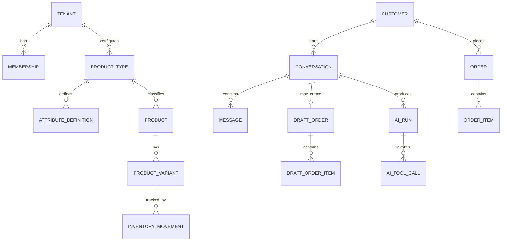

# Data Model — Conceptual

## قواعد عامة

- كل كيان يخص متجرًا يحمل `tenant_id` غير قابل للفراغ.
- المعرفات داخلية وعشوائية، بينما Product Code قابل للعرض ويكون فريدًا داخل المتجر.
- الحذف الافتراضي Soft Delete للبيانات التشغيلية؛ السجلات المحاسبية والتدقيق لا تحذف عاديًا.
- timestamps تحفظ UTC، وتعرض حسب Timezone المتجر.
- حقول JSONB تُتحقق من Schema وتملك `schema_version` عند الحاجة.

## الكيانات

| الكيان                | أهم الحقول                                                                     | ملاحظات                             |
| --------------------- | ------------------------------------------------------------------------------ | ----------------------------------- |
| tenants               | id, name, locale, timezone, status                                             | المتجر/المستأجر                     |
| users                 | id, identity_provider_id                                                       | هوية عالمية                         |
| memberships           | tenant_id, user_id, role, status                                               | مصدر الصلاحيات                      |
| product_types         | tenant_id, name, slug, template_key                                            | نوع مخصص أو مستنسخ من Template      |
| attribute_definitions | product_type_id, key, label, data_type, required, variant_axis                 | تعريف قابل للتخصيص                  |
| products              | tenant_id, product_type_id, code, name, description, status, custom_attributes | الحقول المشتركة + القيم الديناميكية |
| product_variants      | product_id, sku, attributes, price_override, status                            | توليفة قابلة للبيع                  |
| product_media         | product_id, object_key, sort_order                                             | صور وملفات                          |
| content_product_links | tenant_id, channel, external_content_id, product_id                            | Reel/Post/Product mapping           |
| inventory_locations   | tenant_id, code, name, is_default                                              | موقع افتراضي واحد لكل متجر          |
| inventory_movements   | tenant_id, location_id, variant_id, deltas, idempotency_key                    | Ledger append-only                  |
| inventory_balances    | tenant_id, location_id, variant_id, on_hand, reserved, reorder_point           | Projection ذري                      |
| stock_reservations    | tenant_id, location_id, variant_id, quantity, status, reference                | active → released/committed         |
| customers             | tenant_id, name, phone, email, metadata                                        | Dedup داخل المتجر                   |
| customer_addresses    | customer_id, label, address fields                                             | Snapshot لاحقًا داخل الطلب          |
| conversations         | tenant_id, customer_id, channel, status, assigned_to                           | سياق المحادثة                       |
| messages              | conversation_id, direction, sender_type, content, external_id                  | Idempotent ingest                   |
| draft_orders          | tenant_id, customer_id, conversation_id, status, expires_at                    | قابل للتعديل قبل التأكيد            |
| draft_order_items     | draft_order_id, variant_id, quantity, quoted_price                             | اقتراح الطلب                        |
| orders                | tenant_id, customer_id, number, status, totals, address_snapshot               | سجل مؤكد                            |
| order_items           | order_id, variant_id, product_snapshot, unit_price, quantity                   | Snapshot تاريخي                     |
| business_rules        | tenant_id, key, value, version, status                                         | قواعد Typed ومنشورة                 |
| knowledge_entries     | tenant_id, title, content, status, version                                     | FAQ ومعرفة المتجر                   |
| ai_runs               | tenant_id, conversation_id, model, prompt_version, usage, outcome              | مراقبة وتكلفة                       |
| ai_tool_calls         | ai_run_id, tool, safe_input, result_status, latency                            | لا تحفظ أسرارًا                     |
| handoffs              | conversation_id, reason, summary, assigned_to, resolved_at                     | مسار الموظف                         |
| audit_events          | tenant_id, actor, action, entity, before/after metadata                        | Append-only                         |
| outbox_events         | tenant_id, type, payload, published_at                                         | ضمان الأحداث                        |

## علاقات مختصرة



## مثال خصائص ديناميكية

```json
{
  "productType": "smartphone",
  "attributes": {
    "storage_gb": 256,
    "ram_gb": 8,
    "color": "black",
    "warranty_months": 12
  }
}
```

تعريف النوع يحدد أن `storage_gb` رقم مطلوب، وأن `color` خيار مسموح وربما Variant axis. أي مفتاح مجهول أو نوع قيمة خاطئ يُرفض قبل الحفظ.

## ثوابت Domain

1. `available = on_hand - reserved` ولا يكون سالبًا افتراضيًا.
2. مجموع Order Items والخصومات والشحن يطابق Order total مع قواعد rounding ثابتة.
3. السعر التاريخي في Order Item لا يتغير عند تعديل Product لاحقًا.
4. انتقال الحالة يحدث مرة واحدة وبـIdempotency key.
5. AI لا يكتب في الجداول؛ يستدعي Application Commands مسجلة كـTools.
6. كل relation بين كيانات تشغيلية تتحقق من تطابق `tenant_id`.
7. Content ID لا يحدد منتجًا إلا داخل tenant + channel الصحيحين.

## فهارس أولية

- `(tenant_id, status)` للطلبات والمحادثات والمنتجات.
- unique `(tenant_id, code)` و`(tenant_id, sku)` بحسب السياسة.
- unique `(tenant_id, channel, external_message_id)` للرسائل الخارجية.
- `(tenant_id, phone_normalized)` للعملاء.
- GIN انتقائي على `custom_attributes` بعد قياس Queries الحقيقية، لا افتراضيًا لكل شيء.
