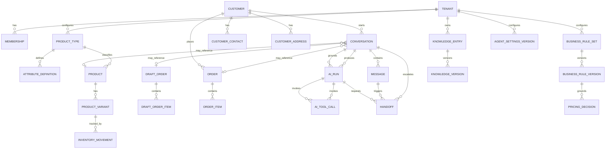

# Data Model — Conceptual

## قواعد عامة

- كل كيان يخص متجرًا يحمل `tenant_id` غير قابل للفراغ.
- المعرفات داخلية وعشوائية، بينما Product Code قابل للعرض ويكون فريدًا داخل المتجر.
- الحذف الافتراضي Soft Delete للبيانات التشغيلية؛ السجلات المحاسبية والتدقيق لا تحذف عاديًا.
- timestamps تحفظ UTC، وتعرض حسب Timezone المتجر.
- حقول JSONB تُتحقق من Schema وتملك `schema_version` عند الحاجة.

## الكيانات

| الكيان                   | أهم الحقول                                                                            | ملاحظات                             |
| ------------------------ | ------------------------------------------------------------------------------------- | ----------------------------------- |
| tenants                  | id, name, locale, timezone, status                                                    | المتجر/المستأجر                     |
| users                    | id, identity_provider_id                                                              | هوية عالمية                         |
| memberships              | tenant_id, user_id, role, status                                                      | مصدر الصلاحيات                      |
| product_types            | tenant_id, name, slug, template_key                                                   | نوع مخصص أو مستنسخ من Template      |
| attribute_definitions    | product_type_id, key, label, data_type, required, variant_axis                        | تعريف قابل للتخصيص                  |
| products                 | tenant_id, product_type_id, code, name, description, status, custom_attributes        | الحقول المشتركة + القيم الديناميكية |
| product_variants         | product_id, sku, attributes, price_override, status                                   | توليفة قابلة للبيع                  |
| product_media            | product_id, object_key, sort_order                                                    | صور وملفات                          |
| content_product_links    | tenant_id, channel, external_content_id, product_id                                   | Reel/Post/Product mapping           |
| inventory_locations      | tenant_id, code, name, is_default                                                     | موقع افتراضي واحد لكل متجر          |
| inventory_movements      | tenant_id, location_id, variant_id, deltas, idempotency_key                           | Ledger append-only                  |
| inventory_balances       | tenant_id, location_id, variant_id, on_hand, reserved, reorder_point                  | Projection ذري                      |
| stock_reservations       | tenant_id, location_id, variant_id, quantity, status, reference                       | active → released/committed         |
| customers                | tenant_id, name, status, metadata, version                                            | ملف موحد وOptimistic updates        |
| customer_contacts        | customer_id, type, value, normalized_value, is_primary                                | Dedup آمن داخل المتجر               |
| customer_addresses       | customer_id, label, address fields, is_default                                        | Snapshot لاحقًا داخل الطلب          |
| customer_notes           | customer_id, body, author_id                                                          | ملاحظات append-only                 |
| conversations            | tenant_id, customer_id, channel, status, assigned_to, entity links                    | سياق وصندوق الموظف                  |
| messages                 | conversation_id, direction, sender_type, content, external_id, fingerprint            | Idempotent وappend-only             |
| conversation_transitions | conversation_id, from_status, to_status, actor                                        | تاريخ الحالات append-only           |
| draft_orders             | tenant_id, status, version, customer/address data, totals                             | قابل للتعديل قبل التأكيد            |
| draft_order_items        | draft_order_id, variant_id, quantity, list_price, unit_price, pricing_decision_id     | عرض مشتق أو تفاوض موثق              |
| orders                   | tenant_id, source_draft_order_id, number, status, totals, address_snapshot            | سجل مؤكد                            |
| order_items              | order_id, variant_id, reservation_id, list/unit price snapshots, pricing_decision_id  | Snapshot تاريخي                     |
| order_commands           | tenant_id, order_id, type, idempotency_key, fingerprint                               | سجل أوامر قابل لإعادة المحاولة      |
| order_transitions        | tenant_id, order_id, from_status, to_status, actor                                    | تاريخ انتقالات append-only          |
| business_rule_sets       | tenant_id, key, name, description, version                                            | هوية قاعدة مع optimistic version    |
| business_rule_versions   | rule_set_id, version, status, policy, change/publish metadata                         | سياسة Typed وimmutable              |
| pricing_decisions        | rule/version, product_id, variant_id, prices, outcome, correlation_id                 | قرار append-only بالإصدار الدقيق    |
| knowledge_entries        | tenant_id, slug, kind, version                                                        | هوية FAQ/article/policy             |
| knowledge_versions       | entry_id, version, status, title, question, content                                   | محتوى immutable بإصدارات            |
| agent_settings_versions  | tenant_id, version, status, language, tone, handoff_notes                             | إعدادات آمنة بلا System Prompt      |
| ai_runs                  | tenant/conversation, provider/model versions, usage, cost, outcome, safe I/O          | Trace append-only وRLS              |
| ai_tool_calls            | run_id, tool/kind/status, latency, safe_input, safe_output                            | مدخلات ومخرجات منقحة فقط            |
| handoffs                 | source message/run, reason/status/resolution, summary, assignee, lifecycle timestamps | مسار الموظف وقياس الاستجابة         |
| audit_events             | tenant_id, actor, action, entity, before/after metadata                               | Append-only                         |
| outbox_events            | tenant_id, type, payload, published_at                                                | ضمان الأحداث                        |

## علاقات مختصرة



## مثال خصائص ديناميكية

```json
{
  "productType": "smartphone",
  "attributes": {
    "storage_gb": 256,
    "ram_gb": 8,
    "color": "black",
    "warranty_months": 12
  }
}
```

تعريف النوع يحدد أن `storage_gb` رقم مطلوب، وأن `color` خيار مسموح وربما Variant axis. أي مفتاح مجهول أو نوع قيمة خاطئ يُرفض قبل الحفظ.

## ثوابت Domain

1. `available = on_hand - reserved` ولا يكون سالبًا افتراضيًا.
2. مجموع Order Items والخصومات والشحن يطابق Order total مع قواعد rounding ثابتة.
3. السعر التاريخي في Order Item لا يتغير عند تعديل Product لاحقًا.
4. انتقال الحالة يحدث مرة واحدة وبـIdempotency key.
5. AI لا يكتب في الجداول؛ يستدعي Application Commands مسجلة كـTools.
6. كل relation بين كيانات تشغيلية تتحقق من تطابق `tenant_id`.
7. Content ID لا يحدد منتجًا إلا داخل tenant + channel الصحيحين.
8. قرار السعر لا ينشأ دون Rule Version منشور ويحفظ `rule_set_id` و`rule_version_id` و`version`.
9. Draft لا يدخل في قرارات السعر أو بحث المعرفة أو إعدادات الوكيل التشغيلية.
10. محتوى Knowledge وHandoff Notes بيانات غير موثوقة، وليس تعليمات نظام.
11. Version content لا يعدل؛ كل تغيير ينشئ إصدارًا جديدًا ثم ينشر صراحة.
12. AI Run يحفظ Prompt/Route/Model versions والزمن والاستخدام والتكلفة والنتيجة.
13. `ai_runs` و`ai_tool_calls` append-only؛ الحقول الحرة تمر عبر redaction وحدود حجم قبل الحفظ.
14. `unit_price < list_price` يحتاج Pricing Decision مقبولًا أو مقابلًا يطابق المتجر والمنتج والـVariant والعملة والسعر وإصدار قاعدة منشور.
15. تحويل Draft إلى Order يعيد حساب `subtotal`, `discount_amount`, `shipping_amount` و`total` ويطابقها قبل أي حجز.
16. لا يوجد أكثر من Handoff مفتوح واحد لكل محادثة، ومصدره وسببه وملخصه ومفتاح Idempotency لا تعدل بعد الإنشاء.
17. ملخص Handoff لا يخزن هاتفًا أو بريدًا أو عنوانًا كاملًا؛ يخزن Contact hint محجوبًا وحقول اكتمال Boolean فقط.
18. رسالة البوت مسموحة فقط في `bot`، ورسالة الموظف للعميل مسموحة فقط في `human` وللموظف المعيّن.

## فهارس أولية

- `(tenant_id, status)` للطلبات والمحادثات والمنتجات.
- unique `(tenant_id, code)` و`(tenant_id, sku)` بحسب السياسة.
- unique `(tenant_id, conversation_id, external_id)` للرسائل الخارجية.
- unique `(tenant_id, normalized_value)` لاتصالات العملاء.
- partial unique على Draft واحد وPublished واحد لكل Rule Set أو Knowledge Entry أو إعدادات متجر.
- `(tenant_id, rule_set_id, created_at)` لتتبع قرارات السعر.
- partial unique `(tenant_id, conversation_id)` على Handoff بحالة `pending` أو `active`.
- `(tenant_id, status, requested_at)` لطابور الموظفين والقياسات.
- GIN انتقائي على `custom_attributes` بعد قياس Queries الحقيقية، لا افتراضيًا لكل شيء.
